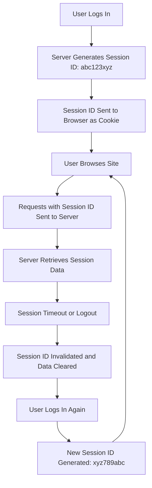

# Visual Flow of Session Lifecycle:

```mermaid
graph TD;
    A[User Logs In] --> B[Server Generates Session ID: abc123xyz];
    B --> C[Session ID Sent to Browser as Cookie];
    C --> D[User Browses Site];
    D --> E[Requests with Session ID Sent to Server];
    E --> F[Server Retrieves Session Data];
    F --> G[Session Timeout or Logout];
    G --> H[Session ID Invalidated and Data Cleared];
    H --> I[User Logs In Again];
    I --> J[New Session ID Generated: xyz789abc];
    J --> D;
```
